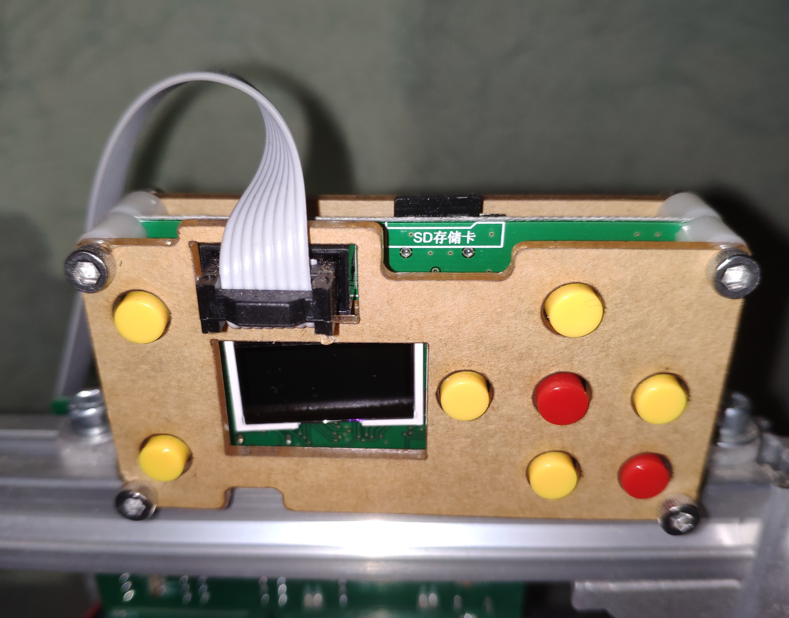

The firmware on the CNC3018 mainboard is the open source GRBL.

https://github.com/gnea/grbl

I can control the CNC via USB and the Software Candle:

https://github.com/Denvi/Candle

or i can use the GRBL offline controller. It has a couple of button and a small display.
The NC-code can be stored on a micro-SD card and put into the offline controller.
Then you can start the job without the need of an extra computer.
